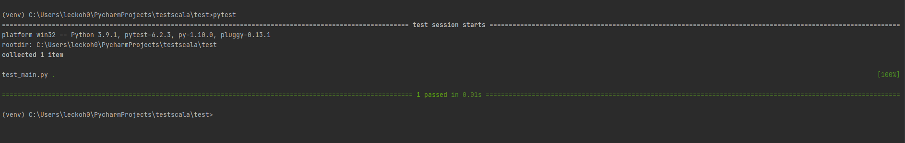
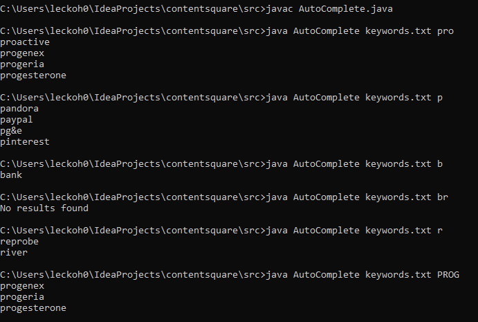
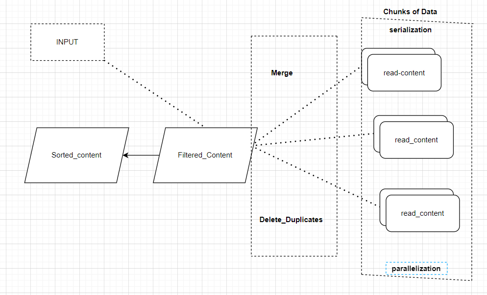
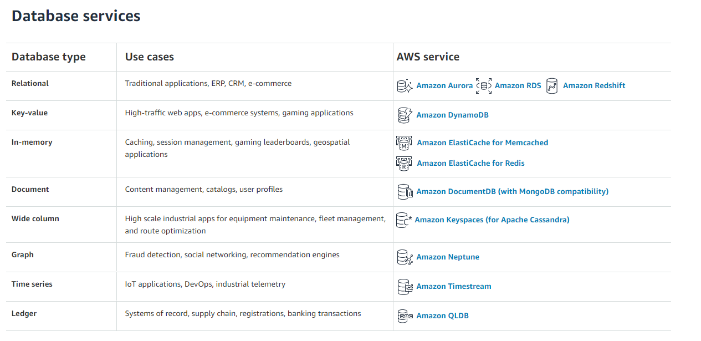

# Auto-complete test

I have submitted in 2 languages. One in Python and another in Java. (One with variable and another with file loading)

In Python, There are 2 files

- Main.py (Implementation)
- test_main.py (pytest) (to test this pytest need to be installed)

```sh
py main.py
""to use test case""
pip install pytest
pytest
```

## Output for Python Program


**Test Case:**



In Java, there are 2 files

- AutoComplete.java (Implementation)
- keywords.txt(it can be file or Db connection or var)

To execute the above java file, First, we need to install Java in our system and need to check by "javac". then enter

```sh
javac
javac AutoComplete.java
java AutoComplete keywords.txt searchKeyword
For example, java AutoComplete keywords.txt pro
```

## Output for Java Program



**In java, If we want to add unit tests we need to use external library junit.**

## Think about optimization and algorithmic complexity, explaining the tradeoffs that you chose to made if any

- Complexity analysis (Time complexity and Space complexity)
- Big O notation "O(n)"
- As Data engineers, we care about measuring how fast an algorithm runs as the size of input increases.

>Timsort is a hybrid sorting algorithm, derived from merge sort and insertion sort,
> designed to perform well on many kinds of real-world data. It was invented by Tim Peters
> in 2002 for use in the Python programming language. The algorithm finds subsets of the data
> that are already ordered, and uses the subsets to sort the data more efficiently. This is
> done by merging an identified subset, called a run, with existing runs until certain criteria
> are fulfilled. Timsort has been Python's standard sorting algorithm since version 2.3.
> It is now also used to sort arrays in Java SE 7, and on the Android platform.

[Source](https://en.wikipedia.org/wiki/Timsort) - Timsort

| Python | Java |
| ------ | ------ |
| Sorted | Collections.sort|
| Startswith | Startswith|
| Timsort | Timsort |
| Worst-case performance - O(n log n) |Worst-case performance - O(n log n) |
| Best-case performance - O(n) |Best-case performance - O(n)|
| Average performance - O(n log n) |Average performance - O(n log n) |
| Worst-case space - O(n) | Worst-case space - O(n)|

>Time complexity is not just the measure of algorithm speed, but it's more specifically the
> measure of algorithm speed or runtime as the size of the input to the algorithm increases.

## What would you change if the list of keywords was much larger (300 Gb)? Please explain and describe the concepts that would allow handling this if you decide to use specific tools (frameworks, databases…)



> As per my understanding, We need to break it down into chunks of data and using serialization
> or parallelization and scale it using Kubernetes to merge and delete duplicates and apply
> filter by taking input as argument and sort according.
> For this maybe we can use Spark and store in Hive metastore, but it will be time taking process.
> I don't think it can help us.

## If any databases



[Source](https://aws.amazon.com/products/databases/) - Database Services or any other cloud provider

## What would you change if the requirements were to match any portion of the keywords (for example, given the string “pro”, the program could suggest the keyword “reprobe”) ?

For this, I don't have much knowledge of how we can achieve it but using some suggestion algorithms or ML we will be able to get it.
but in my Python Code:

it is possible with a substring

````python
def filter_content(word, content): # This is to filter the given content
    return [match for match in content if word.lower() in match]
````

For example:

````python
if "pro" in "reprobe":
````

here it stores reprobe but not in the top 4 indexes so when we limit it to 4 we don't see in results.

We can also do the same thing using regex by

````python
import re
if re.search('pro','reprobe'):
````

## Implementation code for both python and java

**Python**
````python
def read_content():  # This will be infra "can be DB connectivity or read File or var". Here returns
    # list of all keywords available and returns the list of strings.
    return ['project runway', 'pinterest', 'river', 'kayak', 'progenex', 'progeria', 'pg&e', 'project free tv',
            'bank', 'proactive', 'progesterone', 'press democrat', 'priceline', 'pandora', 'reprobe', 'paypal']


def _autocomplete_controller(word):  # This controller takes 1 arguments. word - from user input
    content = read_content()
    # In big data it is always preferred to first Filter data according to user input and then sort it.
    filtered_content = filter_content(word, content)
    if not filtered_content:
        print("No results found")
    else:
        sorted_content = sort_clean_autocomplete_content(filtered_content)
        #  prints the list of best matching strings
        _display_autocomplete(sorted_content)


def filter_content(word, content):  # This is to filter the given content
    return [match for match in content if match.startswith(word.lower())]


def sort_clean_autocomplete_content(filtered_content, nb_items=4):  # sorts the content alphabetically
    # return up to 4 best matching strings
    return sorted(filtered_content)[:nb_items]


def _display_autocomplete(autocomplete_content):  # display according to user requirement
    # prints the list of best matching strings
    print('\n'.join(autocomplete_content))


_autocomplete_controller(input('enter keyword: '))

'''
Python uses an algorithm called Timsort:

Timsort is a hybrid sorting algorithm, derived from merge sort and insertion sort, designed to perform well on 
many kinds of real-world data. It was invented by Tim Peters in 2002 for use in the Python programming language. The 
algorithm finds subsets of the data that are already ordered, and uses the subsets to sort the data more efficiently. 
This is done by merging an identified subset, called a run, with existing runs until certain criteria are fulfilled. 
Timsort has been Python's standard sorting algorithm since version 2.3. It is now also used to sort arrays in Java SE 
7, and on the Android platform. 

Source link: https://en.wikipedia.org/wiki/Timsort stackoverflow: 
https://stackoverflow.com/questions/10948920/what-algorithm-does-pythons-sorted-use#:~:text=3%20Answers&text=Python
%20uses%20an%20algorithm%20called,kinds%20of%20real%2Dworld%20data. '''

````

**java**

```java
import java.nio.charset.StandardCharsets;
import java.util.List;
import java.util.Collections;
import java.nio.file.Paths;
import java.nio.file.Files;
import java.io.IOException;
import java.util.stream.Collectors;

class AutoComplete {

    /*
        main method takes two arguments
        args[0] - filepath, The text file which contains the keywords
        args[1] - SearchKeyWord, The input search keyword which needs to be autocompleted
        prints the list of best matching strings
    */
    public static void main (String[] args) {

        List<String> keyWords = read_content(args[0]);
        List<String> results = filter_content(args[1], keyWords);
        if (results.size() == 0)
            System.out.println("No matches found for the string " + args[1]);

        // Printing the best matching strings
        results.forEach(System.out::println);
    }

    /*
        reads the text file which contains list of all keywords available
        and returns the list of strings.
    */
    public static List<String> read_content(String fileName) {

        try {
            return Files.readAllLines(Paths.get(fileName), StandardCharsets.UTF_8);
        }
        catch(IOException ex) {
            // logs error message if any in reading the file
            System.out.println( "Error in reading file " + fileName);
            return Collections.emptyList();
        }
    }

    /*
        filters and returns upto 4 strings
    */
    public static List<String> filter_content(String searchKeyword, List<String> keyWords) {

        List<String> matches = keyWords.stream().filter(item -> item.toLowerCase().startsWith(searchKeyword.toLowerCase())).collect(Collectors.toList());
        sort_clean_autocomplete_content(matches);

        // return upto 4 best matching strings
        return matches.stream().limit(4).collect(Collectors.toList());
    }

    /*
        sorts the content alphabetically
    */
    public static void sort_clean_autocomplete_content(List<String> matches) {
        Collections.sort(matches);
    }

/*
    We are using Collections.sort method here

    The way Collections.sort works is that it actually takes the collection's underlying array,
    and calls its sort method to sort the actual elements. That sorting algorithm used by Java is
    the lightning-fast Timsort.

    Worst-case performance - O(n log n)
    Best-case performance  - O(n)
    Average performance    - O(n log n)
    Worst-case space       - O(n)
    https://en.wikipedia.org/wiki/Timsort

*/

/*
    Note: This program cannot handle huge data.
    because all the data being loaded into in-memory(RAM) at a time.
    to achieve this, we need to use database
*/}
```

**If we don't want to use Command line arguments. then we can use below code:**
```java
import java.nio.charset.StandardCharsets;
import java.util.List;
import java.util.Collections;
import java.nio.file.Paths;
import java.nio.file.Files;
import java.io.IOException;
import java.util.stream.Collectors;

class AutoComplete {
        // prints the list of best matching strings
    public static void main (String[] args) {

        //file path
        String fileName = "keywords.txt";
        //input string
        String searchKeyword = "prog";
        List<String> keyWords = readKeyWords(fileName);
        List<String> results = autoComplete(searchKeyword, keyWords);
        if (results.size() == 0)
            System.out.println("No matches found for the string " + args[1]);

        // Printing the best matching strings
        results.forEach(System.out::println);
    }

    /*
        reads the text file which contains list of all keywords available
        and retuns the list of strings.
    */
    public static List<String> readKeyWords(String fileName) {

        try {
            return Files.readAllLines(Paths.get(fileName), StandardCharsets.UTF_8);
        }
        catch(IOException ex) {
            // logs error meessage if any in reading the file
            System.out.println( "Error in reading file " + fileName);
            return Collections.emptyList();
        }
    }

    /*
        filters and returns upto 4 strings
    */
    public static List<String> autoComplete(String searchKeyword, List<String> keyWords) {

        List<String> matches = keyWords.stream().filter(item -> item.toLowerCase().startsWith(searchKeyword.toLowerCase())).collect(Collectors.toList());
        sortContent(matches);

        // return upto 4 best matching strings
        return matches.stream().limit(4).collect(Collectors.toList());
    }

    /*
        sorts the content alphabetically
    */
    public static void sortContent(List<String> matches) {
        Collections.sort(matches);
    }
}

/*
    We are using Collections.sort method here

    The way Collections.sort works is that it actually takes the collection's underlying array,
    and calls its sort method to sort the actual elements. That sorting algorithm used by Java is
    the lightning-fast Timsort.

    Worst-case performance - O(n log n)
    Best-case performance  - O(n)
    Average performance    - O(n log n)
    Worst-case space       - O(n)
    https://en.wikipedia.org/wiki/Timsort

*/

/*
    Note: This program cannot handle huge data.
    because all the data being loaded into in-memory(RAM) at a time.
    to achieve this, we need to use database
*/
```
